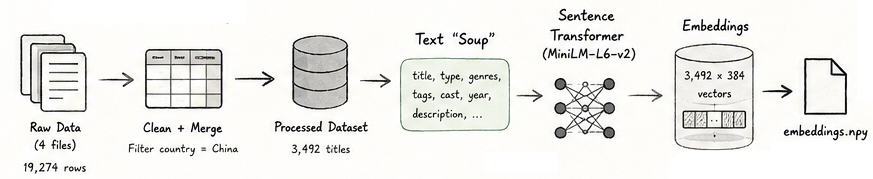
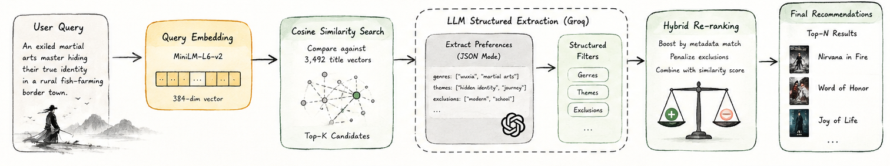
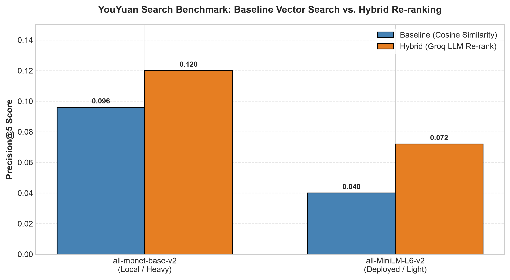

# YouYuan 有缘 — a semantic recommendation engine for Chinese dramas

Live demo: https://youyuan-coral.vercel.app

## Motivation

I grew up watching Chinese shows as a way to stay connected to my heritage, and C-Dramas became a way for me to practice Chinese while experiencing stories and aspects of Chinese culture that felt different from what I grew up with in the US. While K-Dramas have gone properly global with shows like *Goblin*, C-Dramas still sit in the shadow of that, despite having just as much going for them. I also know how tedious it is to find something to watch when you don't already know the genre or the language. 

So I wanted to build a better way to discover them: what if you could simply describe what you're in the mood for, "An exiled martial arts master hiding their true identity in a rural fish-farming border town.", and get recommendations that actually understand what you mean, rather than just matching keywords or genres? 

That question became YouYuan, a semantic recommendation engine designed to help people discover C-dramas through natural language. The name comes from 有缘 (yǒuyuán) — "to have a fated connection."

## Overview

YouYuan is built on a two-stage hybrid retrieval architecture consisting of an offline preprocessing pipeline, an in-memory vector search layer, and a structured LLM re-ranking engine.

### Data & Embedding Pipeline (Offline)


### Semantic Recommendation Engine (Online)


I didn't go for a vector database or a framework like LangChain for any of this. At 3,492 rows, brute-force cosine similarity is fast enough that a vector DB adds nothing but complexity, and I wanted to own the retrieval pipeline myself and to understand it. The one hard architectural rule I kept throughout: the LLM explains and re-ranks, but it never invents. Every recommendation traces back to real embedding similarity over the real dataset.

## Dataset

I used Kaggle's [Asian Drama Dataset](https://www.kaggle.com/datasets/lakhindarpal/asian-drama-dataset), which ships as four separate files by content type — dramas, movies, TV shows, specials. I loaded and merged all four (19,274 rows total), tagged each with its `content_type`, filtered to `country == China`, and cleaned down to **3,492 titles**.

Each title gets converted into a combined text "soup" before embedding — title, type, genres, tags, cast, year, description — since embedding with just the title is not particularly useful:

```
Title: Nirvana in Fire
Type: drama
Genres: Military, Historical, Drama, Political
Tags: Power Struggle, Smart Male Lead, Scheme, Hidden Identity, Revenge
Cast: Hu Ge, Liu Tao, Wang Kai...
Year: 2015
Description: In sixth-century China, the Emperor of Great Liang...
```

The source files are nested JSON (genres and tags are lists of `{name, id}` dicts, cast is nested under `main`/`support`), and the four files don't share identical schemas — movies have no episode count — so the cleaning step has to flatten everything rather than assume a fixed shape.

## Evaluation

This is a very important step. **The obvious approach is to hand-label 50-100 queries myself, this has a problem: it mostly measures my own taste (introduce a lot of bias), and it's brutally tedious at that scale.** So instead, ground truth for a 30-query benchmark comes from **MyDramaList's crowd-sourced "similar title" recommendation data**, pulled via an unofficial API. For each test query, I picked a seed drama matching its genre/mood, fetched MDL's community-recommended titles for that seed, cross-referenced them against my own dataset, and used what survived as the relevance labels — a filter with a minimum vote threshold to weed out low-confidence one-off suggestions.

Real methodology bugs along the way, worth naming since they changed the actual numbers: the API's search sometimes resolves an ambiguous title to the wrong show entirely (multiple unrelated dramas can share an exact title — I hit this with "The Bad Kids," "The Double," and a few others), fixed with a manual disambiguation list cross-checked against year and synopsis. The initial minimum-vote threshold (5) was too strict — plenty of genuinely good MDL recommendations have very low vote counts — lowered to 1 after checking the raw data.

Results, measured against that 30-query benchmark:



**Query Expansion (Failed Experiment):** I initially tried having an LLM expand short user prompts into descriptive text prior to vector search. This degraded performance. Even with strict system prompts, temperature set to `0`, and one-shot examples, the LLM generated narrative prose rather than the concise, comma-separated tags present in the target metadata. Because embedding models are highly sensitive to text structure and density, rich descriptive paragraphs shifted the query vector away from the corpus's terse metadata style.

**The Fix:** Instead of modifying the input query, I shifted the LLM downstream. I used Groq in JSON mode to extract structured filters (genres, themes, explicit exclusions) directly from the user's input, using these parameters to post-filter and re-rank the cosine similarity hits against dataset metadata.

## Deployment

Deploying on Render's 512MB RAM free tier exposed immediate memory limits when loading PyTorch and `sentence-transformers` at runtime.

### Memory Optimization & Pre-computation
1. **Model Swap:** Switched vector embeddings from `all-mpnet-base-v2` to `all-MiniLM-L6-v2` to reduce memory footprint.
2. **Dependency Trimming:** Purged non-essential development packages (`chromadb`, `gradio`, Jupyter) from `requirements.txt`.
3. **Build Pipeline Decoupling:** Bypassed runtime embedding generation entirely by pre-computing `.npy` embedding vectors locally and committing them to Git. The backend service now loads pre-computed arrays directly into memory at startup, bypassing heavy PyTorch build steps on cloud infrastructure.

### Performance Impact
* **Base Retrieval:** Precision@5 dropped from **0.096** (`all-mpnet-base-v2`) to **0.040** (`all-MiniLM-L6-v2`).
* **Hybrid Re-ranking:** Precision@5 dropped from **0.120** to **0.072**.
* **System Delta:** The hybrid Groq LLM re-ranking layer maintained a consistent **~1.8x relative performance lift** over raw cosine search regardless of the underlying embedding model, confirming that the re-ranking logic functions independently of base vector quality.

## Current Market Solutions

Realistically, LangChain and a hosted vector DB would get you most of the retrieval pipeline in a fraction of the code. I deliberately didn't use them — partly because I wanted to actually understand and debug the pipeline myself (which mattered directly: the index/position bug above was only catchable because I was working with the raw dataframe and embedding array directly, not through an abstraction that hid that relationship), and partly because at 3,492 rows, none of the complexity those tools solve for was actually a problem I had.

## Known limitations

- Subjective, unlabeled attributes ("handsome lead," "pretty visuals") aren't supported — the dataset has no signal for this, and it's a data-availability gap, not a retrieval-quality one.
- The 30-query MDL-sourced benchmark is small by design — the goal was a defensible, less-biased methodology, not comprehensive coverage.
- No personalization, watch history, or accounts — deliberately out of scope; the whole system is stateless and reads from flat files loaded once into memory, which is also why there's no database.

## Stack

Python, pandas, sentence-transformers, scikit-learn (cosine similarity), Groq, FastAPI, React + TanStack, GSAP. Backend deployed on Google Cloud Run, frontend on Vercel.

## Running it locally

```bash
# Backend
python -m venv venv && source venv/bin/activate
pip install -r requirements.txt
python src/data/preprocess.py
python src/embeddings/embed.py
uvicorn app.main:app --reload --port 8000

# Frontend (separate terminal)
cd frontend
npm install
npm run dev
```

Needs a free [Groq API key](https://console.groq.com) in a `.env` file:
```
GROQ_API_KEY=your_key_here
```

## Project structure

```
YouYuan/
├── src/
│   ├── data/            # loading, cleaning, MyDramaList eval integration
│   ├── embeddings/       # embedding generation
│   └── recommendation/   # search, hybrid re-ranking, evaluation
├── app/                  # FastAPI backend
├── frontend/              # React + TanStack frontend
├── data/processed/       # cleaned dataset, embeddings, eval query set
└── DESIGN.md              # full design & methodology document
```
