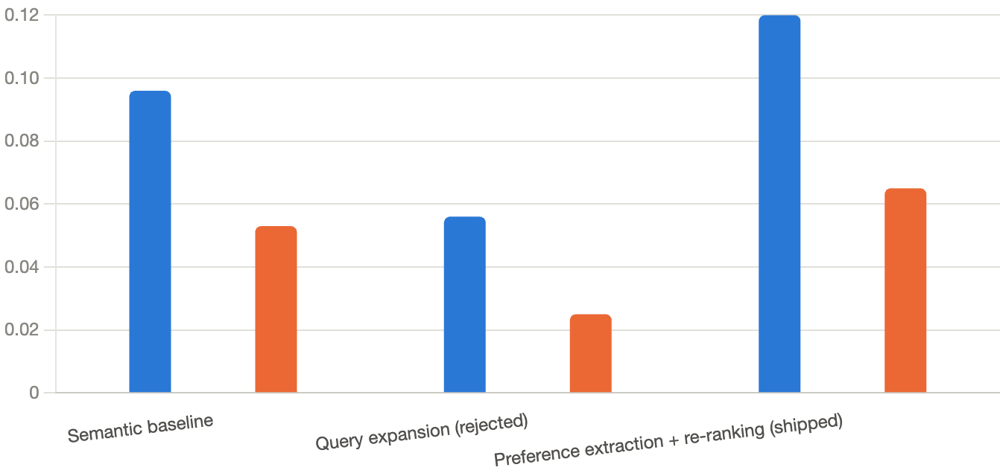

# YouYuan 有缘 — a semantic recommendation engine for Chinese dramas

Live demo: https://youyuan-coral.vercel.app

## Motivation

I grew up watching Chinese shows as a way to stay connected to my heritage, and C-Dramas became a way for me to practice Chinese while experiencing stories and aspects of Chinese culture that felt different from what I grew up with in the US. While K-Dramas have gone properly global, *Goblin*, but C-Dramas still sit in the shadow of that, despite having just as much going for them. I also know how tedious it is to find something to watch when you don't already know the genre or the language. 

So I wanted to build a better way to discover them: what if you could simply describe what you're in the mood for, "An exiled martial arts master hiding their true identity in a rural fish-farming border town.", and get recommendations that actually understand what you mean, rather than just matching keywords or genres? 

That question became YouYuan, a semantic recommendation engine designed to help people discover C-dramas through natural language. The name comes from 有缘 (yǒuyuán) — "to have a fated connection."

## Overview

At its core, this project has three pieces: a semantic retrieval layer, an LLM re-ranking layer, and a full-stack app around both of them.

```
Raw dataset (4 files, 19,274 rows)
        │
        ▼
   Clean + merge → 3,492 titles
        │
        ▼
   Embed every title (sentence-transformers)
        │
        ▼
   ┌─────────────────────────┐
   │  User types a query      │
   └────────────┬─────────────┘
                ▼
   Embed the query, cosine similarity
   against all 3,492 title vectors
                │
                ▼
   Top-K candidates
                │
                ▼
   LLM extracts structured preferences
   (genres / themes / exclusions, JSON mode)
                │
                ▼
   Boost/penalize candidates by keyword
   match against the dataset's own metadata
                │
                ▼
   Final ranked list → React frontend
```

I didn't go for a vector database or a framework like LangChain for any of this. At 3,492 rows, brute-force cosine similarity is fast enough that a vector DB adds nothing but complexity, and I wanted to own the retrieval pipeline myself and to understand it. The one hard architectural rule I kept throughout: the LLM explains and re-ranks, but it never invents. Every recommendation traces back to real embedding similarity over the real dataset.

## Dataset

Kaggle's [Asian Drama Dataset](https://www.kaggle.com/datasets/lakhindarpal/asian-drama-dataset), which ships as four separate files by content type — dramas, movies, TV shows, specials. I loaded and merged all four (19,274 rows total), tagged each with its `content_type`, filtered to `country == China`, and cleaned down to **3,492 titles**.

Each title gets converted into a combined text "soup" before embedding — title, type, genres, tags, cast, year, description — since embedding with just the title is not particularly useful:

```
Title: Nirvana in Fire
Type: drama
Genres: Military, Historical, Drama, Political
Tags: Power Struggle, Smart Male Lead, Scheme, Hidden Identity, Revenge
Cast: Hu Ge, Liu Tao, Wang Kai...
Year: 2015
Description: In sixth-century China, the Emperor of Great Liang...
```

The source files are nested JSON (genres and tags are lists of `{name, id}` dicts, cast is nested under `main`/`support`), and the four files don't share identical schemas — movies have no episode count, TV shows have no director field — so the cleaning step has to flatten everything defensively rather than assume a fixed shape.

## Evaluation

This is a very important step, because "does this work" is the question every recommendation project claims to answer and most don't actually measure.

**The obvious approach is to hand-label 50-100 queries myself, this has a problem: it mostly measures my own taste (introduce a lot of bias), and it's brutally tedious at that scale.** So instead, ground truth for a 30-query benchmark comes from **MyDramaList's crowd-sourced "similar title" recommendation data**, pulled via an unofficial API. For each test query, I picked a seed drama matching its genre/mood, fetched MDL's community-recommended titles for that seed, cross-referenced them against my own dataset, and used what survived as the relevance labels — a filter with a minimum vote threshold to weed out low-confidence one-off suggestions.

Real methodology bugs along the way, worth naming since they changed the actual numbers: the API's search sometimes resolves an ambiguous title to the wrong show entirely (multiple unrelated dramas can share an exact title — I hit this with "The Bad Kids," "The Double," and a few others), fixed with a manual disambiguation list cross-checked against year and synopsis. The initial minimum-vote threshold (5) was too strict — plenty of genuinely good MDL recommendations have very low vote counts — lowered to 1 after checking the raw data.

Results, measured against that 30-query benchmark:



[chart shown above]

**The negative result is the part worth actually explaining.** My first attempted improvement was an LLM rewriting short queries into richer descriptive text before embedding — the idea being that "historical romance with political intrigue" is short and ambiguous, so give it more to work with. It made things worse. Across several prompt attempts (explicit format constraints, a one-shot example, `temperature=0`), the model reliably produced narrative prose — *"a brooding, rain-slick metropolis where neon flickers..."* — instead of anything resembling my corpus's dense, structured `Genres:`/`Tags:` format. That's a real style mismatch, and embeddings are sensitive to surface form, not just meaning — a beautifully written paragraph about a detective story embeds nowhere near a terse metadata listing about a detective story, even though a human would call them "about the same thing."

The fix that worked wasn't a better prompt — it was a different architecture. I switched to Groq's forced JSON mode to extract structured genre/theme/exclusion keywords, then used those to boost or penalize the existing semantic search results by direct keyword match against the dataset's own metadata, never touching the embedding step at all. JSON-schema compliance turned out to be far more reliable than free-text format instructions, and sidestepping the embedding entirely avoided the style-mismatch problem structurally instead of trying to prompt-engineer around it.

## Deployment

This part didn't go smoothly, and I think it's worth documenting honestly rather than pretending it was one clean `git push`.

I built and evaluated everything against `all-mpnet-base-v2`. Deploying it hit a wall immediately: Render's free tier caps at 512MB RAM, and a PyTorch + sentence-transformers stack blows past that before you've even loaded a model, let alone the encoding step. I swapped to the much smaller `all-MiniLM-L6-v2` — still OOM'd. I stripped `requirements.txt`, which turned out to be a raw `pip freeze` of my entire dev environment (it had `chromadb`, `gradio`, and Jupyter tooling in it — none of which the actual server uses) — still OOM'd, even with the lighter model and a trimmed dependency list.

At that point the honest read was that 512MB just isn't enough for this kind of app, full stop, regardless of which specific fix I tried next. Render's cheapest paid tier turned out not to help either — Starter is $7/month but *still* 512MB; the RAM bump only comes at Standard ($25/month). I moved the backend to **Google Cloud Run** instead, which lets you configure memory allocation directly and has a genuinely usable free tier for a low-traffic demo. That's what's actually running the live version now, on the smaller MiniLM model.

The honest cost of that model swap: retrieval quality measurably drops with MiniLM (Precision@5 0.096 → 0.040 on baseline, 0.120 → 0.072 on the hybrid approach) — but the *relative* improvement from the re-ranking approach holds almost exactly the same (roughly 1.8x over baseline either way), which tells me the re-ranking logic itself is doing real, model-independent work; the cost is entirely in base retrieval quality from the smaller model. That's a real infrastructure tradeoff, made under a real constraint, and I'd rather report it than hide it.

## Other real bugs, worth naming

- **Silent data-integrity bug:** after `dropna`/`drop_duplicates`, the dataframe's index had gaps, which meant positional embedding lookups (`embeddings[idx]`) and label-based lookups (`df.loc[idx]`) silently disagreed — the wrong vector for a given row, no error thrown. Fixed with `reset_index(drop=True)`, caught by a nearest-neighbor sanity check that returned nonsense until it didn't.
- **Deprecated model ID:** an AI coding assistant suggested a Groq model name that had actually been deprecated days earlier. Caught by checking Groq's current docs before running, not by trusting the suggestion — worth remembering that any assistant's knowledge of a fast-moving API can be stale.

## What I'd have used off-the-shelf

Realistically, LangChain and a hosted vector DB would get you most of the retrieval pipeline in a fraction of the code. I deliberately didn't use them — partly because I wanted to actually understand and debug the pipeline myself (which mattered directly: the index/position bug above was only catchable because I was working with the raw dataframe and embedding array directly, not through an abstraction that hid that relationship), and partly because at 3,492 rows, none of the complexity those tools solve for was actually a problem I had.

## Known limitations

- Subjective, unlabeled attributes ("handsome lead," "pretty visuals") aren't supported — the dataset has no signal for this, and it's a data-availability gap, not a retrieval-quality one.
- The 30-query MDL-sourced benchmark is small by design — the goal was a defensible, less-biased methodology, not comprehensive coverage.
- No personalization, watch history, or accounts — deliberately out of scope; the whole system is stateless and reads from flat files loaded once into memory, which is also why there's no database.

## Stack

Python, pandas, sentence-transformers, scikit-learn (cosine similarity), Groq, FastAPI, React + TanStack, GSAP. Backend deployed on Google Cloud Run, frontend on Vercel.

## Running it locally

```bash
# Backend
python -m venv venv && source venv/bin/activate
pip install -r requirements.txt
python src/data/preprocess.py
python src/embeddings/embed.py
uvicorn app.main:app --reload --port 8000

# Frontend (separate terminal)
cd frontend
npm install
npm run dev
```

Needs a free [Groq API key](https://console.groq.com) in a `.env` file:
```
GROQ_API_KEY=your_key_here
```

## Project structure

```
YouYuan/
├── src/
│   ├── data/            # loading, cleaning, MyDramaList eval integration
│   ├── embeddings/       # embedding generation
│   └── recommendation/   # search, hybrid re-ranking, evaluation
├── app/                  # FastAPI backend
├── frontend/              # React + TanStack frontend
├── data/processed/       # cleaned dataset, embeddings, eval query set
└── DESIGN.md              # full design & methodology document
```
